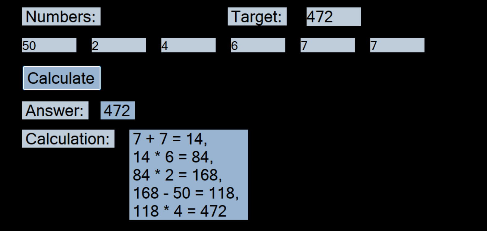

## Countdown solver

Given 6 usable numbers, 1 target number and following the rules of the countdown gameshow, the program will calculate the best/closest answer and display its working out. This is all done through a GUI.

## Features

- 6 numbers can be inputted to be used in the calculation
- 1 target number can be inputted
- will calculate the closest possible number to the target that can be achieved
- shows the working out
- does this using a recursive technique
- the calculations follow countdown's rules

## Installation

visual studio 2022 with the .NET framework

## Controls

click on the blank labels and type with the keyboard to enter the numbers

## Demo

## Credits

Code and UI by me
Inspired by the Countdown gameshow
